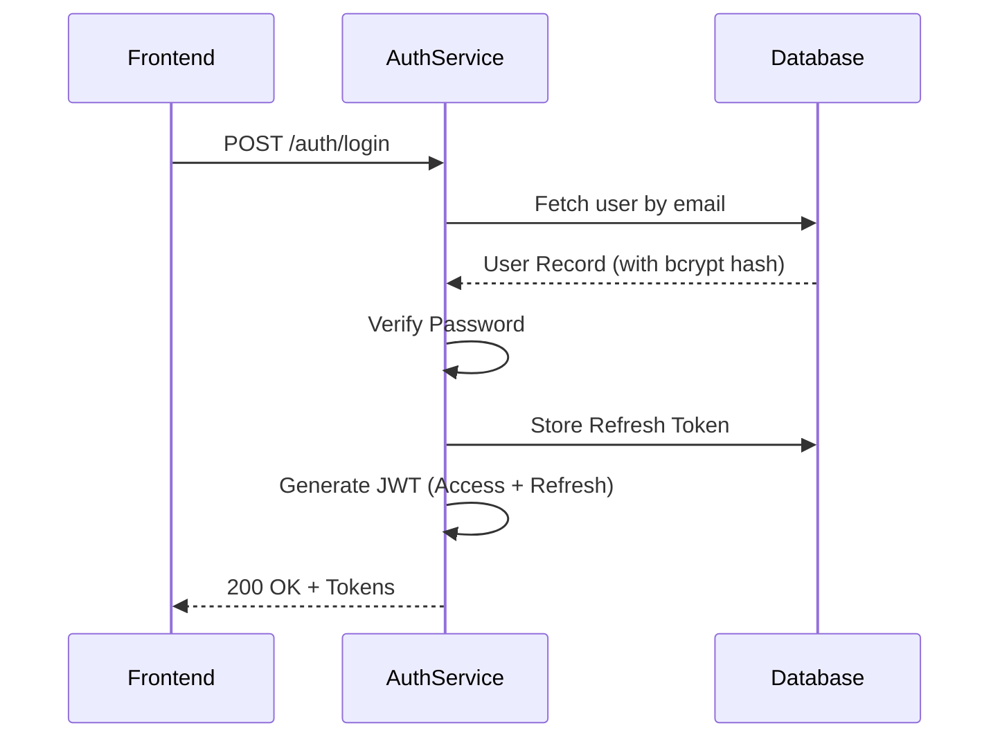
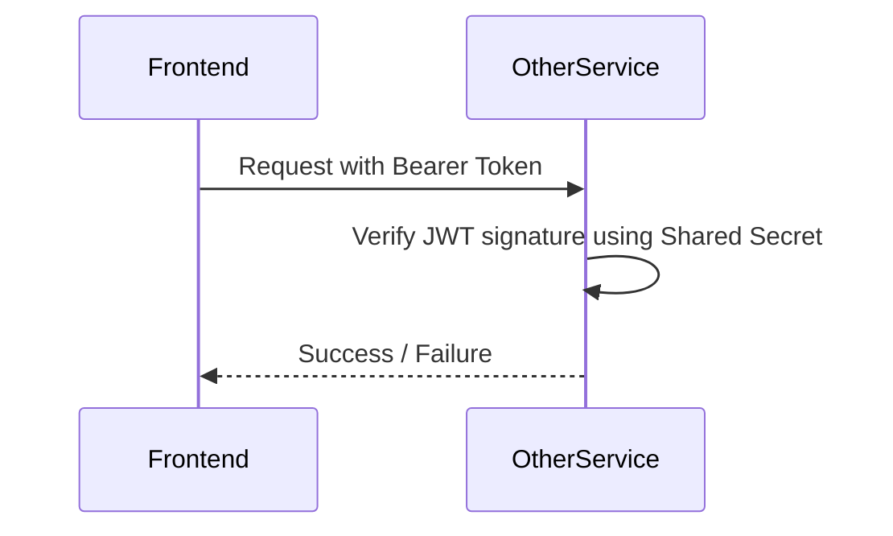

# Authentication Service Architecture

The **Auth Service** is a centralized identity management system built with Node.js and Express. It provides secure user registration, authentication, Role-Based Access Control (RBAC), and multi-tenant organization support for the NextGenQA ecosystem.

## 🚀 Overview
The service acts as the "Gatekeeper" for all other microservices. It validates user credentials, issues signed JSON Web Tokens (JWTs), and manages users, organizations, and projects in a self-hosted PostgreSQL database using Docker.

---

## 🛠️ Technology Stack
- **Runtime:** Node.js (TypeScript)
- **Framework:** Express.js
- **Database:** PostgreSQL (Dockerized)
- **Database Client:** `pg` (node-postgres)
- **Security:** 
  - `bcrypt` for password hashing
  - `jsonwebtoken` for stateless authentication and refresh token management
  - `zod` for request validation

---

## 📊 Database Schema
The service manages a self-contained database schema with strict referential integrity.

### Tables
1. `organizations` - Core tenant boundary for multi-tenant isolation.
2. `users` - Core identity and credentials (passwords hashed with bcrypt).
3. `projects` - Projects belonging to organizations.
4. `project_members` - Mapping users to projects with varying roles.
5. `refresh_tokens` - Stateful token revocation and rotation mechanisms.

---

## 🔄 Sequence Diagrams

### Authentication Flow (Login)
This diagram illustrates how a user authenticates and receives tokens.

### Microservice Verification Flow
How other microservices verify the user without calling the Auth Service directly.

---

## 🛡️ Security Implementation

### 1. Password Protection
The service never stores plain-text passwords. Every password is salted and hashed using `bcrypt` before being persisted to PostgreSQL.

### 2. Stateless Access Tokens
Upon successful login, a JWT access token is issued containing:
- `userId`: The unique User ID.
- `organizationId`: The organization the user belongs to.
- `role`: The RBAC role for authorization (e.g. `ORGANIZATION_OWNER`, `MEMBER`).
- `exp`: Expiration timestamp (default: 120 minutes).

### 3. Stateful Refresh Tokens
Refresh tokens are stored in the `refresh_tokens` database table. This allows the system to immediately revoke access if an account is compromised, and securely issue new access tokens without requiring re-authentication.

### 4. Shared Secret
The `JWT_SECRET` is shared across all microservices. This allows other services to verify users instantly without making a network call back to the Auth Service, significantly reducing latency.

---

## 🛠️ Local Development
To run the service locally:
1. Navigate to `/auth-service`.
2. Ensure you have copied `.env.example` to `.env` and set the required variables.
3. Start the database with `docker-compose up -d`.
4. Start the server with `pnpm dev`.
5. The API will be available on `http://localhost:3001`.
