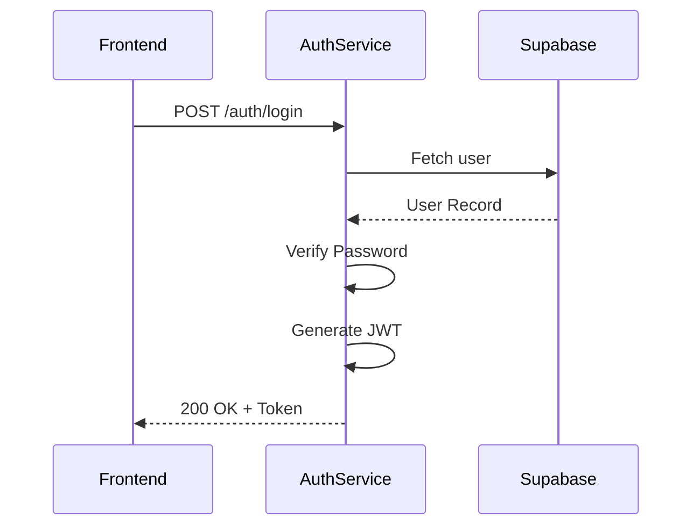
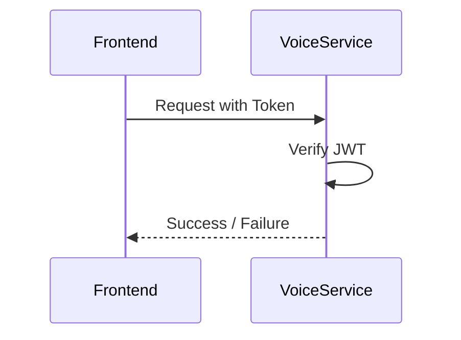

# Authentication Service Architecture

The **Auth Service** is a centralized identity management system built with Node.js and Express. It provides secure user registration, authentication, and profile management for the NextGenQA ecosystem.

## 🚀 Overview
The service acts as the "Gatekeeper" for all other microservices. It validates user credentials, issues signed JSON Web Tokens (JWTs), and manages extended user profiles stored in Supabase.

---

## 🛠️ Technology Stack
- **Runtime:** Node.js (TypeScript)
- **Framework:** Express.js
- **Database:** Supabase (PostgreSQL)
- **Security:** 
  - `bcryptjs` for password hashing
  - `jsonwebtoken` for stateless authentication
  - `zod` for request validation

---

## 📊 Database Schema
The service manages two primary tables in the Supabase `public` schema:

### 1. `users` Table
Stores core identity and credentials.
| Column | Type | Description |
| :--- | :--- | :--- |
| `id` | `text` (PK) | Unique user ID (prefix: `usr-`) |
| `email` | `text` (Unique) | Normalized user email |
| `password_hash` | `text` | Argon2/Bcrypt hashed password |
| `full_name` | `text` | User's display name |
| `agile_role` | `text` | Assigned Agile role (e.g., Developer, PO) |
| `created_at` | `timestamp` | UTC registration time |

### 2. `user_profiles` Table
Stores extended metadata for the user.
| Column | Type | Description |
| :--- | :--- | :--- |
| `user_id` | `text` (PK, FK) | References `users.id` |
| `display_name` | `text` | Public display name |
| `job_title` | `text` | Corporate role/title |
| `bio` | `text` | Short biography |
| `timezone` | `text` | User's local timezone |
| `phone` | `text` | Contact number |
| `updated_at` | `timestamp` | Last profile update |

---

## 🔄 Sequence Diagrams

### Authentication Flow (Login)
This diagram illustrates how a user authenticates and receives a token that can be used across the system.

### Microservice Verification Flow
How other services (like the Voice Parser) verify the user without calling the Auth Service directly.

---

## 🛡️ Security Implementation

### 1. Password Protection
The service never stores plain-text passwords. Every password is salted and hashed using `bcryptjs` before being persisted to Supabase.

### 2. Stateless JWTs
Upon successful login, a JWT is issued containing:
- `sub`: The unique User ID.
- `email`: User email for display.
- `role`: The agile role for authorization.
- `exp`: Expiration timestamp (default: 120 minutes).

### 3. Shared Secret
The `AUTH_SECRET` is shared across all microservices. This allows the Voice and RAG services to verify users instantly without making a network call back to the Auth Service, significantly reducing latency.

---

## 🛠️ Local Development
To run the service locally:
1. Navigate to `/auth-service`.
2. Ensure your `.env` has the `SUPABASE_URL` and `SUPABASE_KEY`.
3. Run `pnpm dev`.
4. Access documentation at `GET /health`.
